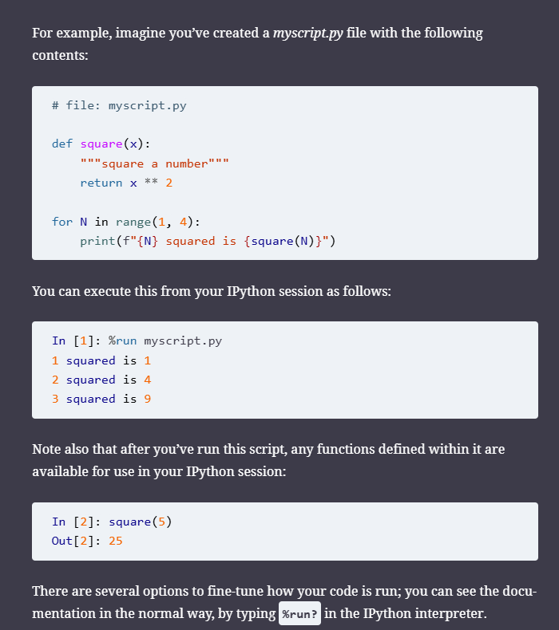
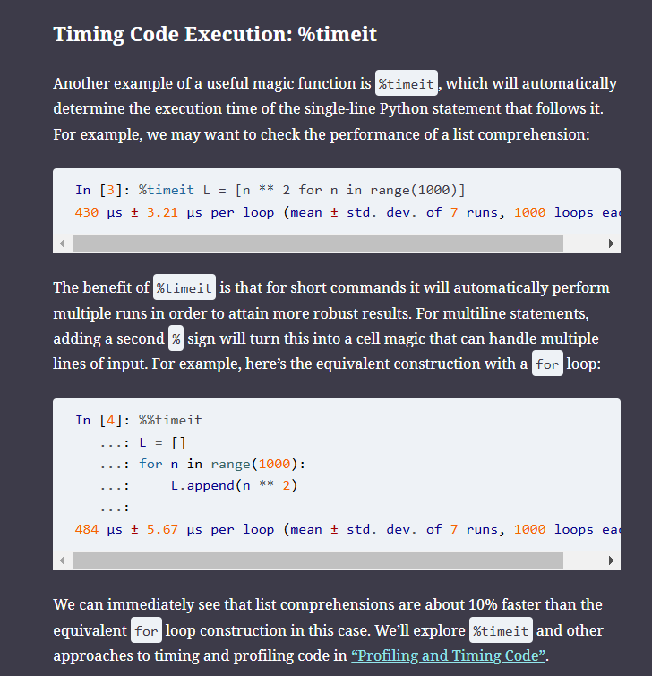
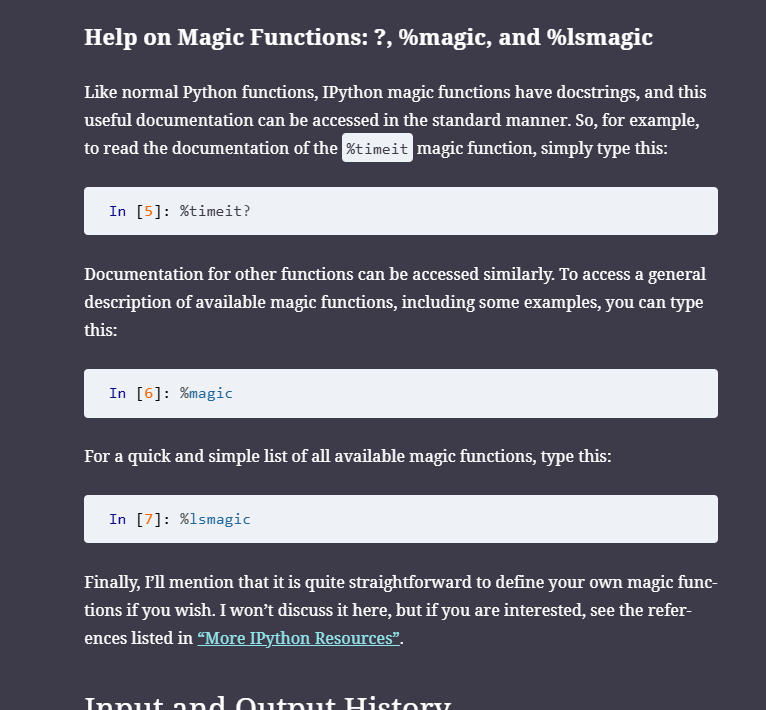
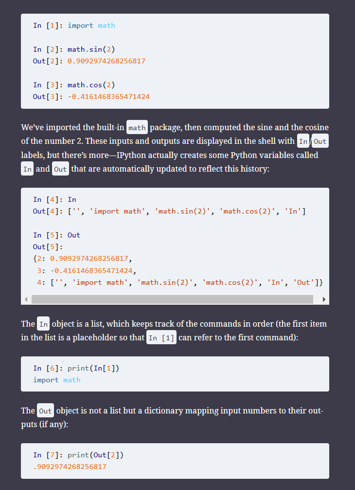
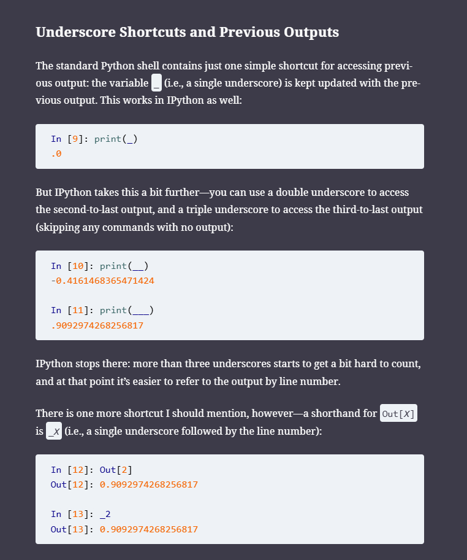
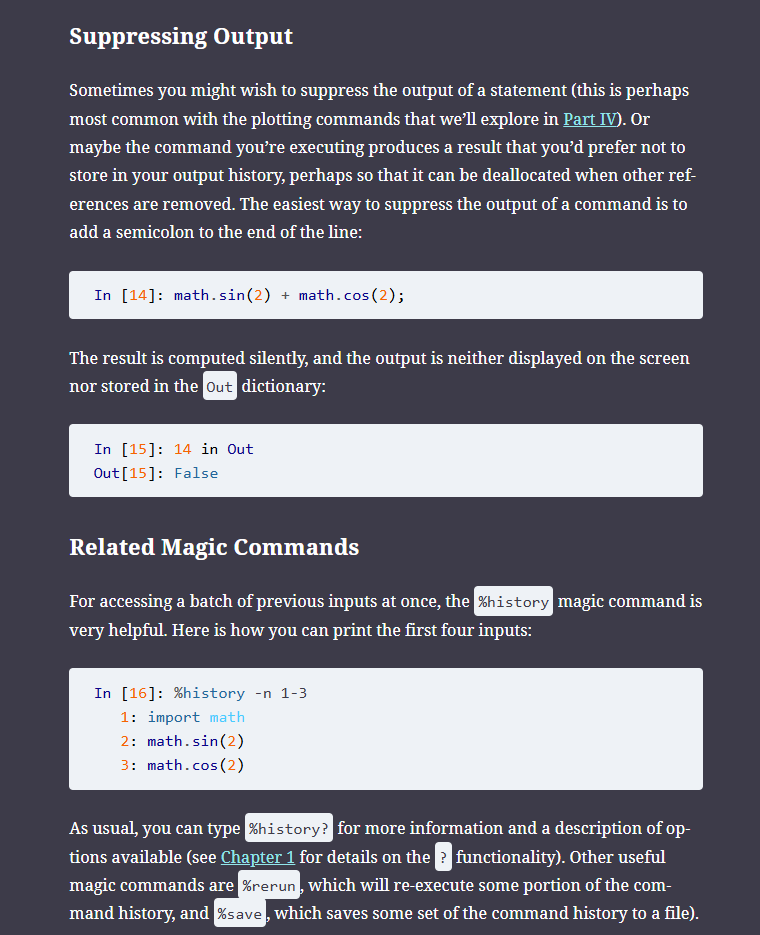
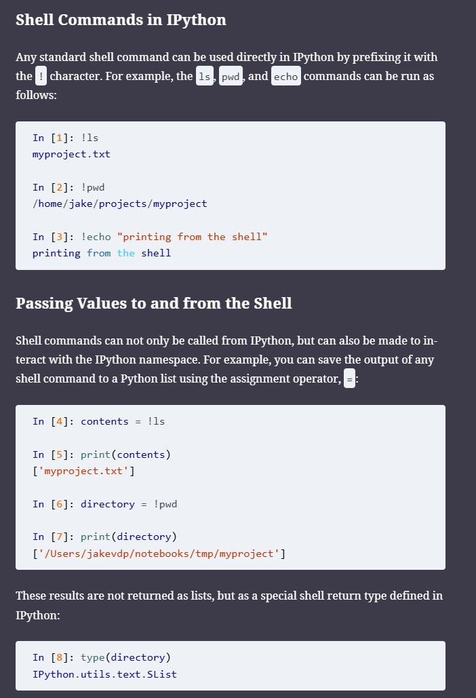
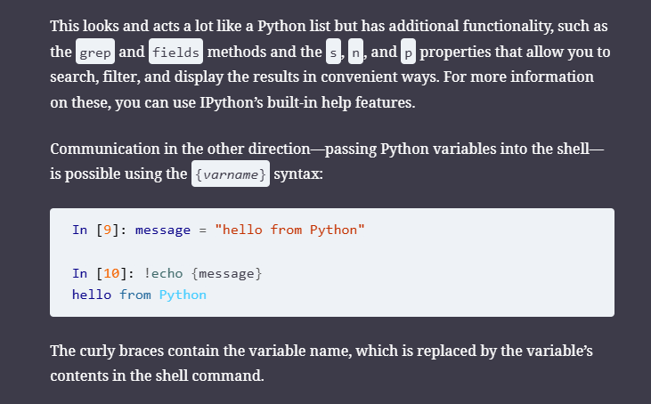
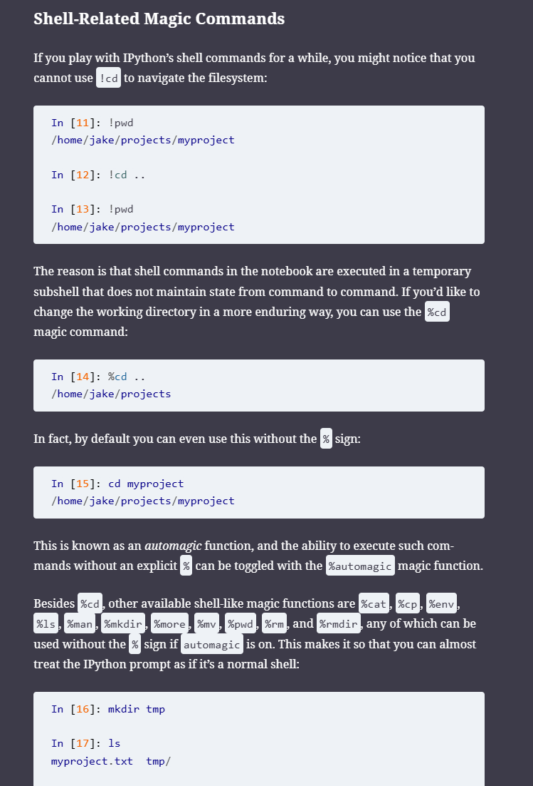

*magic commands*
prefixed by %
- line magic %
- cell magics %% 

*input and output history*
string versions of input and output of commands you just ran on IPython 

commands that return none are not added to output
output is basically a data structure, usually a list that stores the commands and the results 

%rerun - rerun a set of commands 
%save - svaes a set of command history to a file

- Ipython basically ensures that you dont have to constantly switch between the editors and the shell to execute your programs 
- thats basically it 
- shell/terminal/command line basically the same thing
- a program that allows you to communicate with the file system/os
- use exclamatory mark before shell commands 
`!pwd`

