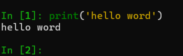
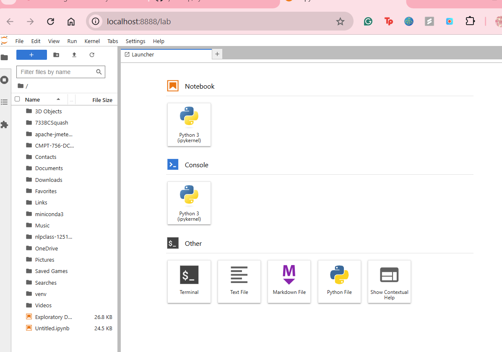
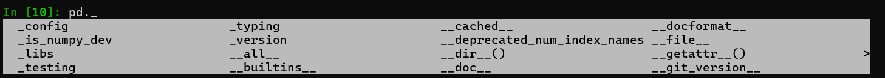
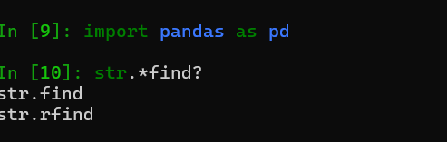
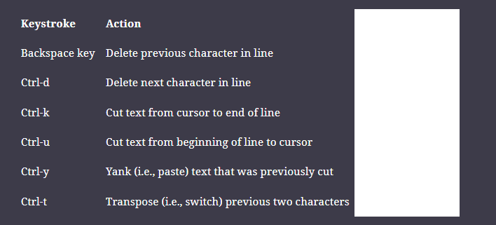
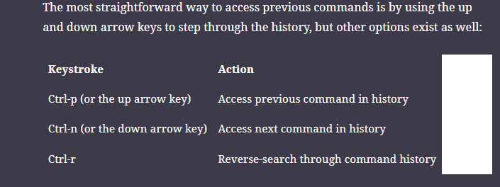
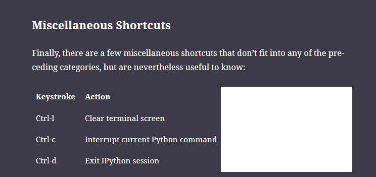

PART 1 Jupyter: Beyond Normal Python 
- IPython + Vscode (best environment)
- A tool for interaction with the engine 
- IPython is basically a fancier Python shell with colour coding and some shorthand commands that make our lives easier when working on a data science project
- Jupyter is now the most famous type of IPython shell 
- Provides many interfaces and the most popular one is Jupyter Notebook 
- Jupyter Notebook is broswer based -> useful for collaborating, sharing, documentaion, experiementation and even pulication of data science results 
- most notable thing about IPython and Jupyter are *'magic commands'* 

# H1 Geting Started in IPython and Jupyter

author's workflow
- IPython - try short sequences of commands
- Jupyter Notebook - for longer interactive analyis + sharing content
-IDE's - creating reusable python packages
## H2 Launch IPython Shell 

`ipython`

## H2 Launch Jupyter Notebook
- format text, static and dynamic visualizations, math equations, javascript widgets etc
- view and edit on the web browser but they need to connect to a running python process to execute the code 
-process called kernel, run the system on the shell to start it 

`jupyter lab`

### H3 What can Ipython/Jupyter do?
- access to documentation 
- help find information about the programming language in a few key strokes

- how to call the function, what arguments does it have?
- what does the soruce code of this Python object look like? 
- what is this package I imported? 
- what attributes or methods does this object have? 

`?` explore documentstion
`??` explore source code 
Tab for autocompletion 

`help(len)`
-shows what that function inputs and what it returns 

`len?` gives more detailed information 
`L.insert` for information about a method
`custom_function_name?` for info on function we define ourselves 
for inbuilt functions however, ? and ?? displays the same results
because the object in question is implemented in C or some other compiled extension language 
- can also apparently use TAB but it does not seem to work on command prompt (you have to first import the package you want to use and then the tab works )
- _ denotes internal/private attributes of classes, the default list does not display them but you can view them by explicitly typing underscore with the TAB
`pd._<TAB>`

*python dunder methods* double underscore methods

- tab autocompletion on imports
*Wildcard matching* for when you have several items of the same spelling but you want to match inbetween

## H2 Ipython shell shortcuts
### H3 Navigation shortcuts
ctrl-a : cursor to beginning of line 
ctrl-e : cursor to end of line
ctrl - b or left arrow key : cursor back one character
ctrl-f or right arrow key : cursor forward one character

### H3 Text entry shortcuts

### Command History Shortcuts 
- entire command line history is srored in a SQLite database in IPython profile directory

### Miscellaneous Shortcuts

